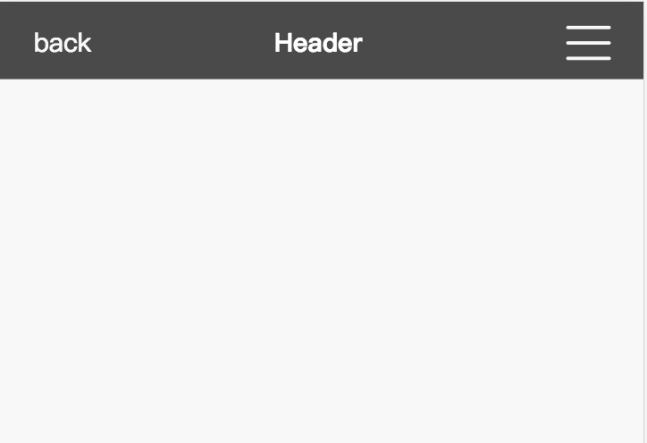

# SimpleUI

## Use

```javascript
// import part of components
import Vue from "vue";
import {Header, Button, ...} from "./simpleUI";

Vue.component(Header.name, Header);
Vue.component(Button.name, Button);
...

// full import
import SimpleUI from "./simpleUI"l

Vue.use(SimpleUI);
```

---

## Button

name: "sp-button"

#### params:

- color: (default | black | blue | yellow | red)
- size: (small | default | big)

#### use:

```html
<sp-button color="blue" size="small">
    Confirm
</sp-button>
```

## Header



name: "sp-header"

#### params:

- title
- lett
- right

#### use:

```html
<sp-header>
    <span slot="left">back</span>
    <span slot="title">title</span>
    <span slot="right">options</span>
</sp-header>
```

## Toggle

name: "sp-toggle"

#### params:

* @param {array} items
* @param {string} color (white | black)
* @param {string} panelColor (white | black)

#### use:

```html
<template>
    <sp-toggle :items="items" panelColor="black" color="white"/>
</template>

<script>
    data(){
        return{
            items: [
                {
                    name: "home",
                    to: "/home"
                },
                {
                    name: "posts",
                    to: "/posts"
                }
            ]
        }
    }
</script>
```

## Message

name: "sp-message"

#### params

* @param {string} message
* @param {boolean} messageShow
* @param {string} cancle btn
* @event messageHandler

#### use:

```html
<sp-message 
    :messageShow="messageShow"
    @messageHandler="messagehandler" 
    cancle="true" 
    message="网络请求发生错误，请刷新页面重试..."
/>
```

## Footer

name: "sp-footer"

#### params

* @param {Array} items (name | icon | to)
    icon: (home | setting | shopping | work | star | safe | img | file | extension | load | reload | menu | account)
* @param {String} theme (light | dark | blue | yellow | sea | fire)

#### use

```html
<sp-footer theme="sea" :items="items"/>
```

## Waiting

name: "sp-waiting"

#### params

* @param {string} tips

#### use

```javascript
<sp-waiting tips="page is loading"/>
```

## Panel

name: "sp-panel"

#### params

 * @param {String} title
 * @param {Array} items
 * @param {theme} theme

```javascript
<sp-panel class="panel" title="常用功能" theme="default" :items="items"/>
```

## card

name: "sp-card"

#### params

* @param {String} title
* @param {String} theme
* @param {Array} items
* @param {String} pages
* @param {eventHandler} leftHandler
* @param {eventHandler} rightHandler

```html
<template>
    <sp-card 
        title="发货单" 
        :items="items"
        pages="10"
        @leftHandler="leftHandler" @rightHandler="rightHandler" />
</template>
```

```javascript
export default {
    data(){
        return {
            items: [{
                title: "order list",
                subTitle: "east of city hotel",
                right: "1000.0¥",
                state: "done",
                desc: [
                    "2010-10-10 - 2018-10-10",
                    "0000051283"
                ]
            }]
        }
    }
}
```